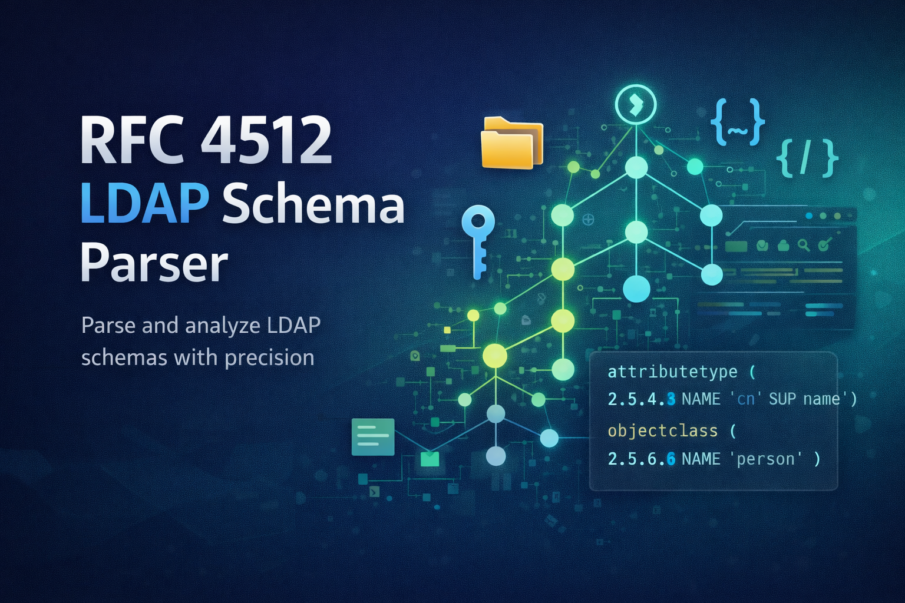

# RFC 4512 LDAP Schema Parser

[](https://github.com/The-Software-Compagny/parser_ldap_rfc4512/actions/workflows/ci.yml)
[](https://codecov.io/gh/The-Software-Compagny/parser_ldap_rfc4512)


[](https://opensource.org/licenses/BSD-3-Clause)



A robust TypeScript parser for LDAP schema definitions based on RFC 4512, featuring a complete CLI tool and comprehensive parsing capabilities using PEG.js grammar.

## Overview

This project provides a comprehensive parser for LDAP (Lightweight Directory Access Protocol) schema definitions according to RFC 4512. It can parse both object class and attribute type definitions with their various components such as OID, NAME, DESC, SUP, MUST, MAY, and object class types (STRUCTURAL, AUXILIARY, ABSTRACT). The parser comes with both a programmatic TypeScript API and a powerful command-line interface.

## ✨ Key Features

### 🔧 Complete RFC 4512 Parser
- **Full RFC 4512 Compliance**: Strictly follows the official LDAP schema definition format
- **OpenLDAP cn=config Support**: Automatically handles OpenLDAP index prefixes like `{57}`
- **Object Class Parsing**: Complete support for STRUCTURAL, AUXILIARY, and ABSTRACT object classes
- **Attribute Type Parsing**: Comprehensive parsing of attribute types with all their properties
- **OID Validation**: Robust validation of numeric object identifiers
- **Multiple Names Support**: Handles single and multiple NAME definitions seamlessly

### 🖥️ Powerful CLI Tool
- **Global Command**: `rfc4512-parser` command available system-wide after installation
- **Multiple Input Sources**: Parse from command line arguments or LDIF files
- **Flexible Output Formats**: Support for JSON, structured text, and custom formatting
- **Verbose Mode**: Detailed parsing information for debugging and analysis
- **Error Reporting**: Comprehensive error messages with line and column information

### 📚 Developer-Friendly API
- **TypeScript First**: Written in TypeScript with complete type definitions
- **Robust Grammar**: Uses PEG.js for precise and reliable parsing
- **Error Handling**: Detailed error system with exact error location
- **Simple Integration**: Easy-to-use `parseSchema()` function
- **Module Support**: Compatible with both ESM and CommonJS environments

### 🧪 Production Ready
- **Comprehensive Testing**: ~100% test coverage with real-world LDAP schemas
- **CI/CD Pipeline**: Automated testing with GitHub Actions
- **Performance Optimized**: Built with Bun for optimal performance
- **Well Documented**: Complete documentation with practical examples

## 🚀 Quick Start

### Installation

```bash
# Install as a library
npm install @the-software-compagny/parser_ldap_rfc4512

# Or with Bun
bun add @the-software-compagny/parser_ldap_rfc4512

# Install globally for CLI usage
npm install -g @the-software-compagny/parser_ldap_rfc4512
```

### Basic Usage

```typescript
import { parseSchema } from '@the-software-compagny/parser_ldap_rfc4512'

// Parse an object class definition
try {
  const result = parseSchema(`
    ( 2.5.6.6
      NAME 'person'
      DESC 'RFC2256: a person'
      SUP top
      STRUCTURAL
      MUST ( sn $ cn )
      MAY ( userPassword $ telephoneNumber $ description )
    )
  `)

  console.log('✅ Successfully parsed:', result)
  // Output:
  // {
  //   oid: '2.5.6.6',
  //   name: 'person',
  //   desc: 'RFC2256: a person',
  //   sup: 'top',
  //   type: 'STRUCTURAL',
  //   must: ['sn', 'cn'],
  //   may: ['userPassword', 'telephoneNumber', 'description']
  // }
} catch (error) {
  console.error('❌ Parse error:', error.message)
}
```

## 💻 Command Line Interface

The CLI provides a powerful way to parse LDAP schemas directly from the terminal.

### Basic CLI Usage

```bash
# Parse a schema definition directly
rfc4512-parser "( 2.5.6.6 NAME 'person' SUP top STRUCTURAL )"

# Parse from a file
rfc4512-parser --input schema.ldif

# Output as formatted JSON
rfc4512-parser --input schema.ldif --format json

# Save results to a file
rfc4512-parser --input schema.ldif --output parsed-schema.json

# Verbose mode with detailed information
rfc4512-parser --input schema.ldif --verbose
```

### Advanced CLI Features

```bash
# Parse multiple schema definitions from a file
rfc4512-parser --input multiple-schemas.ldif --format json

# Validate schema syntax without output
rfc4512-parser --input schema.ldif --validate-only

# Parse with custom error formatting
rfc4512-parser --input schema.ldif --verbose --format json
```

📖 **For complete CLI documentation, see [CLI_USAGE.md](CLI_USAGE.md)**

## 📋 Supported Schema Components

### Object Classes
The parser handles all RFC 4512 object class components:

- **OID**: Numeric object identifier (e.g., `2.5.6.6`)
- **NAME**: Single name (`'person'`) or multiple names (`( 'person' 'user' )`)
- **DESC**: Descriptive text in quotes
- **SUP**: Superior object class (inheritance)
- **Object Class Types**: 
  - `STRUCTURAL` - Standard object classes
  - `AUXILIARY` - Additional attribute sets
  - `ABSTRACT` - Base classes for inheritance
- **MUST**: Required attributes list
- **MAY**: Optional attributes list

### Attribute Types
Complete support for attribute type definitions:

- **OID**: Unique numeric identifier
- **NAME**: Single or multiple attribute names
- **DESC**: Human-readable description
- **SUP**: Superior attribute type
- **EQUALITY**: Equality matching rule
- **ORDERING**: Ordering matching rule
- **SUBSTR**: Substring matching rule
- **SYNTAX**: Attribute syntax OID
- **SINGLE-VALUE**: Single value constraint
- **COLLECTIVE**: Collective attribute marker
- **NO-USER-MODIFICATION**: System-only attributes

### Example Schemas

#### Object Class Example
```ldap
( 2.5.6.7
  NAME ( 'organizationalPerson' 'orgPerson' )
  DESC 'RFC2256: an organizational person'
  SUP person
  STRUCTURAL
  MAY ( title $ x121Address $ registeredAddress $ destinationIndicator $
        preferredDeliveryMethod $ telexNumber $ teletexTerminalIdentifier $
        telephoneNumber $ internationaliSDNNumber $ facsimileTelephoneNumber $
        street $ postOfficeBox $ postalCode $ postalAddress $
        physicalDeliveryOfficeName $ ou $ st $ l )
)
```

#### Attribute Type Example
```ldap
( 2.5.4.3
  NAME ( 'cn' 'commonName' )
  DESC 'RFC2256: common name(s) for which the entity is known by'
  SUP name
)
```

## 🔧 OpenLDAP cn=config Support

The parser includes built-in support for OpenLDAP's `cn=config` format, which uses index prefixes to maintain ordering of multi-valued attributes like `olcAttributeTypes` and `olcObjectClasses`.

### Index Prefix Support

OpenLDAP uses numeric prefixes in curly braces to maintain the order of schema definitions:

```ldap
# OpenLDAP cn=config format with index prefix
{57}( 1.3.6.1.4.1.7165.2.1.80 NAME 'sambaSupportedEncryptionTypes' 
      DESC 'Supported encryption types of a trust' 
      EQUALITY integerMatch 
      SYNTAX 1.3.6.1.4.1.1466.115.121.1.27 
      SINGLE-VALUE )

# Equivalent RFC 4512 pure format (without prefix)
( 1.3.6.1.4.1.7165.2.1.80 NAME 'sambaSupportedEncryptionTypes' 
  DESC 'Supported encryption types of a trust' 
  EQUALITY integerMatch 
  SYNTAX 1.3.6.1.4.1.1466.115.121.1.27 
  SINGLE-VALUE )
```

### Automatic Prefix Removal

The parser automatically detects and removes OpenLDAP index prefixes:

```typescript
import { parseSchema } from '@the-software-compagny/parser_ldap_rfc4512'

// Both formats parse to identical results
const openLdapFormat = '{57}( 2.5.4.3 NAME \'cn\' DESC \'Common Name\' SYNTAX 1.3.6.1.4.1.1466.115.121.1.15 )'
const rfc4512Format = '( 2.5.4.3 NAME \'cn\' DESC \'Common Name\' SYNTAX 1.3.6.1.4.1.1466.115.121.1.15 )'

const result1 = parseSchema(openLdapFormat)
const result2 = parseSchema(rfc4512Format)

console.log(result1 === result2) // true - identical results
```

### Supported Prefix Patterns

The parser handles various OpenLDAP prefix formats:

- **Basic format**: `{0}`, `{57}`, `{123}`
- **With whitespace**: `  {0}  `, `\t{57}\t`
- **Leading spaces**: `   {0}(definition...)`
- **Any numeric index**: `{0}` to `{99999}` and beyond

### CLI Support for OpenLDAP Format

The CLI tool seamlessly handles OpenLDAP exports:

```bash
# Parse OpenLDAP cn=config exports directly
rfc4512-parser --input openldap-export.ldif --format json

# Example OpenLDAP export file content:
# {0}( 2.5.4.3 NAME 'cn' DESC 'Common Name' SYNTAX 1.3.6.1.4.1.1466.115.121.1.15 )
# {1}( 2.5.4.4 NAME 'sn' DESC 'Surname' SUP name )
```

## 🏗️ Project Architecture

```bash
.
├── .github/                               # GitHub workflows and CI/CD configuration
│   └── workflows/                         # Automated testing and build pipelines
├── .vscode/                               # VS Code workspace settings and tasks
├── dist/                                  # Compiled output (generated)
├── src/                                   # Source code
│   ├── _grammars/                         # PEG.js grammar definitions
│   ├── errors/                            # Error handling system
│   ├── functions/                         # Core parsing logic
│   ├── interfaces/                        # TypeScript interfaces
│   ├── types/                             # Type definitions
├── test/                                  # Comprehensive test suite
.
```

## 🔧 Technical Details

### Grammar Engine
- **PEG.js Parser**: Uses Parsing Expression Grammar for precise, unambiguous parsing
- **Error Recovery**: Provides detailed error messages with line and column information
- **Whitespace Handling**: Robust handling of LDAP schema formatting variations
- **Performance**: Optimized grammar rules for fast parsing of large schema files

### Type System
- **Strict TypeScript**: Complete type coverage for all LDAP components
- **Interface-Driven**: Well-defined interfaces for extensibility
- **Error Types**: Comprehensive error type system for debugging
- **Runtime Validation**: Schema validation beyond syntax checking

### Build System
- **Bun Runtime**: Fast JavaScript runtime for optimal performance
- **Tree Shaking**: Optimized builds with unused code elimination
- **Dual Output**: Both ESM and CommonJS compatible builds
- **CLI Bundling**: Self-contained CLI executable

## 🧪 Testing & Quality

### Comprehensive Test Suite
- **Unit Tests**: Complete coverage of all parsing components
- **Integration Tests**: End-to-end testing with real LDAP schemas
- **CLI Tests**: Command-line interface testing with various scenarios
- **Error Handling Tests**: Comprehensive error condition testing

### Real-World Validation
- **OpenLDAP Schemas**: Tested against actual OpenLDAP schema definitions
- **RFC Compliance**: Validated against RFC 4512 specifications
- **Edge Cases**: Extensive testing of formatting variations and edge cases

### Quality Metrics
- **Code Coverage**: ~100% test coverage on core components
- **CI/CD**: Automated testing on multiple Node.js versions
- **Code Quality**: ESLint and Prettier for consistent code style
- **Performance**: Benchmarked against large schema files

## 🤝 Contributing

We welcome contributions! Please see our contributing guidelines for details on:

- Setting up the development environment
- Running tests and building the project
- Code style and formatting requirements
- Submitting pull requests

### Development Setup

```bash
# Clone the repository
git clone https://github.com/The-Software-Compagny/parser_ldap_rfc4512.git
cd parser_ldap_rfc4512

# Install dependencies
bun install

# Run tests
bun test

# Build the project
bun run build

# Test CLI locally
bun run test:cli
```

## 📄 License

This project is licensed under the BSD 3-Clause License - see the [LICENSE](LICENSE) file for details.

## 🔗 Links

- **NPM Package**: [@the-software-compagny/parser_ldap_rfc4512](https://www.npmjs.com/package/@the-software-compagny/parser_ldap_rfc4512)
- **GitHub Repository**: [parser_ldap_rfc4512](https://github.com/The-Software-Compagny/parser_ldap_rfc4512)
- **Issue Tracker**: [GitHub Issues](https://github.com/The-Software-Compagny/parser_ldap_rfc4512/issues)
- **CI/CD Pipeline**: [GitHub Actions](https://github.com/The-Software-Compagny/parser_ldap_rfc4512/actions)
- **Code Coverage**: [Codecov](https://codecov.io/gh/The-Software-Compagny/parser_ldap_rfc4512)

## 📚 Related Resources

- [RFC 4512 - LDAP Directory Information Models](https://tools.ietf.org/html/rfc4512)
- [OpenLDAP Schema Documentation](https://www.openldap.org/doc/admin24/schema.html)
- [PEG.js Documentation](https://pegjs.org/documentation)

---

Made with ❤️ by [The Software Compagny](https://github.com/The-Software-Compagny)
